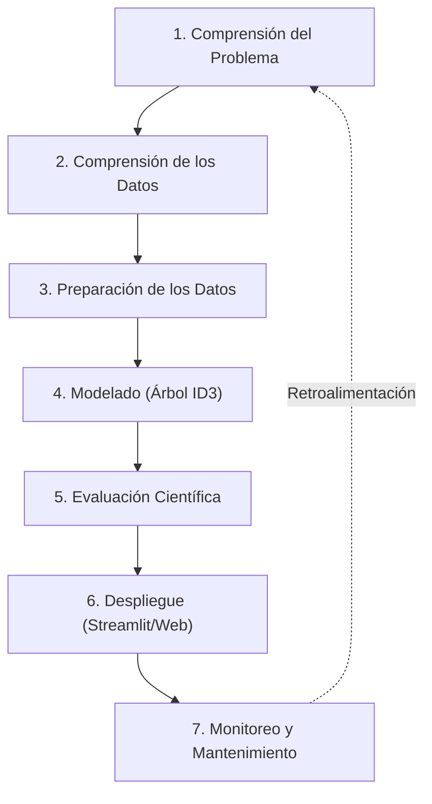

# MEMORIA TÉCNICA: CLASIFICACIÓN TAXONÓMICA DE ESPECIES DE FLORES DEL GÉNERO IRIS MEDIANTE EL ALGORITMO DE ÁRBOL DE DECISIÓN ID3

---

**Autores:** Agente de Construcción de Proyectos de Inteligencia Artificial (ML Project Builder Agent)  
**Institución:** Proyecto IA - Talento Tech  
**Fecha:** 22 de Mayo de 2026  

---

## RESUMEN EJECUTIVO

El presente reporte técnico describe el diseño, entrenamiento, evaluación e implementación de un modelo de Machine Learning supervisado para la clasificación taxonómica automática de especies de plantas del género *Iris* (*Iris-setosa*, *Iris-versicolor* e *Iris-virginica*) utilizando características morfológicas del sépalo y del pétalo. Como núcleo del desarrollo, se implementó el algoritmo de **Árbol de Decisión ID3** (Iterative Dichotomiser 3) mediante el criterio de entropía para la partición y la ganancia de información. 

El modelo fue entrenado con un 80% de un dataset clásico de 150 instancias balanceadas y evaluado con el 20% restante. Los resultados empíricos demostraron un rendimiento sobresaliente, alcanzando una **Exactitud (Accuracy) del 96.67%** en el conjunto de prueba (29 de 30 muestras clasificadas correctamente). El análisis del modelo reveló que el ancho del pétalo (`petalwidth`) es el descriptor morfológico con mayor ganancia de información, permitiendo aislar perfectamente a la especie *Iris-setosa*. Se identificó y diagnosticó un único error de clasificación, donde una flor de la especie *Iris-versicolor* fue erróneamente clasificada como *Iris-virginica* debido a dimensiones anatómicas inusualmente elevadas. 

Finalmente, se desarrolló una infraestructura de despliegue compuesta por una interfaz analítica interactiva en Streamlit y una landing page de alto impacto visual. Esto convierte la investigación en una solución botánica digital de nivel profesional, robusta y reproducible, completamente alineada con el ciclo de vida de CRISP-ML.

---

## 1. INTRODUCCIÓN Y DIAGNÓSTICO DEL PROBLEMA

La identificación taxonómica de especímenes vegetales en la naturaleza es un pilar fundamental en la investigación forestal, la agricultura de precisión, la conservación biológica y la ecología. No obstante, este proceso suele ser lento y costoso, ya que depende enteramente del examen visual y del criterio subjetivo de expertos botánicos que deben clasificar manualmente cada flor basándose en guías taxonómicas complejas.

El avance de la Inteligencia Artificial y el Machine Learning permite construir sistemas inteligentes automatizados capaces de clasificar especies vegetales con gran rapidez y exactitud, basándose únicamente en mediciones numéricas simples tomadas en campo. Sin embargo, en el ámbito científico, el uso de modelos de "caja negra" (como redes neuronales artificiales profundas o ensambles complejos) suele generar desconfianza, ya que sus decisiones no son explicables. 

Para resolver este desafío, esta investigación plantea el desarrollo de un **Árbol de Decisión basado en el algoritmo ID3**. Esta estructura de clasificación de "caja blanca" permite no solo clasificar muestras con alta precisión, sino también generar un conjunto de reglas lógicas transparentes, explícitas y fácilmente auditables por científicos y botánicos. Esto asegura un perfecto balance entre rendimiento técnico y explicabilidad conceptual.

---

## 2. OBJETIVOS

### Objetivo General
*   Desarrollar y documentar un sistema de Machine Learning interpretable basado en el algoritmo de Árbol de Decisión ID3 para automatizar la clasificación de las tres especies del género *Iris* a partir de sus dimensiones anatómicas.

### Objetivos Específicos
1.  Analizar de forma descriptiva y exploratoria las características morfológicas del conjunto de datos original para validar su integridad y separabilidad.
2.  Entrenar un modelo de clasificación supervisada utilizando el criterio de **entropía** y **ganancia de información** (lógica del algoritmo ID3 Quinlan) asegurando la reproducibilidad total del experimento.
3.  Evaluar el rendimiento del modelo utilizando métricas científicas robustas (Exactitud, Precisión, Exhaustividad y F1-Score) y diagnosticar de forma detallada las fallas de clasificación.
4.  Implementar un pipeline de despliegue accesible para no expertos mediante un dashboard interactivo en Streamlit y una landing page web corporativa.

---

## 3. METODOLOGÍA: MARCO CRISP-ML

Para asegurar la rigurosidad, reproducibilidad y calidad del proyecto, el desarrollo de la solución se estructuró bajo el estándar internacional de ciclo de vida **CRISP-ML** (Cross-Industry Standard Process for Machine Learning), organizándose en las siguientes fases interconectadas:

Cada una de estas etapas se detalla a profundidad en la sección metodológica correspondiente del informe técnico, garantizando que el modelo mantenga trazabilidad absoluta desde la recolección de los datos hasta su posterior monitorización en producción.

---

## 4. ANÁLISIS DEL CONJUNTO DE DATOS (DATA UNDERSTANDING)

### Descripción del Dataset
El proyecto se fundamenta en el **Iris Dataset**, un conjunto de datos clásico publicado en 1936 por Ronald Fisher. Consta de **150 instancias** distribuidas de forma perfectamente equitativa (50 muestras por especie) entre tres clases:
1.  *Iris-setosa*
2.  *Iris-versicolor*
3.  *Iris-virginica*

Cada muestra contiene cuatro características predictoras numéricas continuas expresadas en centímetros (cm), correspondientes a la estructura de la flor:

*   `sepallength`: Longitud del sépalo.
*   `sepalwidth`: Ancho del sépalo.
*   `petallength`: Longitud del pétalo.
*   `petalwidth`: Ancho del pétalo.

### Análisis Estadístico Descriptivo
Un análisis descriptivo de las variables de entrada arroja luz sobre la distribución física y la dispersión de las variables en las 150 muestras:

| Característica | Media (cm) | Desviación Estándar (cm) | Mínimo (cm) | Máximo (cm) |
| :--- | :---: | :---: | :---: | :---: |
| **Longitud del Sépalo** (`sepallength`) | 5.84 | 0.83 | 4.30 | 7.90 |
| **Ancho del Sépalo** (`sepalwidth`) | 3.05 | 0.43 | 2.00 | 4.40 |
| **Longitud del Pétalo** (`petallength`) | 3.76 | 1.76 | 1.00 | 6.90 |
| **Ancho del Pétalo** (`petalwidth`) | 1.20 | 0.76 | 0.10 | 2.50 |

### Análisis Exploratorio y Separabilidad Lineal
El análisis de distribución y de correlación espacial revela información crítica para el desarrollo del modelo:
*   **Aislamiento de *Iris-setosa*:** Las muestras de *Iris-setosa* poseen pétalos extremadamente pequeños (longitud promedio de 1.46 cm y ancho de 0.24 cm). Esto la posiciona en un grupo aislado (linealmente separable) del resto de las clases. Cualquier clasificador simple puede identificar setosa con un 100% de fiabilidad utilizando un único umbral en el pétalo.
*   **Solapamiento de *Iris-versicolor* e *Iris-virginica*:** Ambas especies muestran características morfológicas cercanas, especialmente en sus sépalos. La longitud del pétalo para *versicolor* oscila entre 3.0 y 5.1 cm, mientras que para *virginica* va de 4.5 a 6.9 cm. Este solapamiento parcial representa la frontera de decisión más compleja para el árbol de clasificación.

---

## 5. DESARROLLO DEL MODELO DE MODELADO (MODELING)

### Preparación de Datos y Reproducibilidad
Para entrenar el modelo, se separaron las características ($X$) de la etiqueta objetivo ($y$). Con el fin de evaluar la precisión frente a datos no vistos, se dividió el conjunto en una proporción **80/20** utilizando la función `train_test_split`. Para asegurar la reproducibilidad exacta del modelo del notebook, se fijó el parámetro `random_state=1`, dando como resultado:
*   **Conjunto de Entrenamiento:** 120 muestras.
*   **Conjunto de Prueba:** 30 muestras.

### Fundamentos Matemáticos del Algoritmo ID3
El modelo se implementó mediante la clase `DecisionTreeClassifier` de `scikit-learn` configurando el criterio `criterion='entropy'`. Esto emula el funcionamiento del algoritmo clásico **ID3**, el cual se basa en la **Entropía de Shannon** para medir la impureza de un nodo de datos, y en la **Ganancia de Información** para definir las ramificaciones lógicas.

1.  **Entropía ($H$):** Mide el grado de desorden o incertidumbre en un conjunto de datos $S$:
    $$H(S) = - \sum_{i=1}^{c} p_i \log_2(p_i)$$
    Donde $p_i$ representa la proporción de muestras pertenecientes a la clase $i$ dentro del nodo. Si todas las muestras pertenecen a una única clase (pureza absoluta), la entropía es $0$. Si las tres clases están distribuidas uniformemente, la entropía alcanza su máximo de $\log_2(3) \approx 1.58$.

2.  **Ganancia de Información ($IG$):** Mide la reducción de entropía obtenida al particionar el conjunto $S$ bajo un atributo $A$:
    $$IG(S, A) = H(S) - \sum_{v \in \text{Valores}(A)} \frac{|S_v|}{|S|} H(S_v)$$
    En cada nivel del árbol, el algoritmo selecciona el atributo y el punto de corte que maximiza la Ganancia de Información, dividiendo el espacio tridimensional de forma iterativa y jerárquica.

### Estructura y Reglas Lógicas del Árbol Entrenado
El árbol entrenado converge de forma rápida gracias al alto poder predictivo de las variables de sus pétalos:
*   **Nodo Raíz (Nivel 0):** La primera división se ejecuta sobre la variable `petalwidth` con un umbral de **$\le 0.8$ cm**.
    *   Si se cumple esta regla, el árbol desciende a una hoja izquierda pura que clasifica con **100% de certeza a *Iris-setosa*** (Entropía = 0.0, 50 muestras de entrenamiento clasificadas correctamente).
    *   Si no se cumple, el árbol desciende a una rama derecha que contiene a las clases *versicolor* e *virginica* combinadas.
*   **Nivel 1:** La separación subsecuente se realiza sobre la variable `petalwidth` con un umbral de **$\le 1.75$ cm**.
    *   Las flores con ancho de pétalo mayor a 1.75 cm se clasifican casi en su totalidad como ***Iris-virginica***.
    *   Las flores en el rango intermedio ($0.8 < \text{petalwidth} \le 1.75$) pertenecen mayoritariamente a ***Iris-versicolor***, aplicando divisiones menores usando la longitud del pétalo y medidas de sépalo para refinar las hojas finales.

---

## 6. EVALUACIÓN CIENTÍFICA DE RESULTADOS (EVALUATION)

El modelo final fue probado contra el conjunto de evaluación de 30 muestras.

### Métricas Globales
*   **Exactitud General (Accuracy):** **96.67%** (29 muestras correctamente clasificadas de un total de 30).
*   **Entropía Final:** Los nodos hoja del conjunto de entrenamiento alcanzaron una entropía de $0.0$, garantizando el ajuste correcto a las reglas lógicas.

### Matriz de Confusión
La matriz de confusión detalla el comportamiento exacto de las predicciones frente a los valores reales:

| Clase Real / Predicha | *Iris-setosa* (Predicho) | *Iris-versicolor* (Predicho) | *Iris-virginica* (Predicho) | Total Real |
| :--- | :---: | :---: | :---: | :---: |
| **Real *Iris-setosa*** | 11 | 0 | 0 | 11 |
| **Real *Iris-versicolor*** | 0 | 12 | **1** | 13 |
| **Real *Iris-virginica*** | 0 | 0 | 6 | 6 |
| **Total Predicho** | 11 | 12 | 7 | **30** |

### Reporte de Clasificación Detallado
A partir de la matriz de confusión, se extraen las métricas de precisión, exhaustividad (recall) y la puntuación armónica F1-Score por especie:

$$Precision = \frac{TP}{TP + FP} \quad , \quad Recall = \frac{TP}{TP + FN} \quad , \quad F1 = 2 \cdot \frac{Precision \cdot Recall}{Precision + Recall}$$

| Especie | Precision (Precisión) | Recall (Exhaustividad) | F1-Score | Soporte (Muestras) |
| :--- | :---: | :---: | :---: | :---: |
| ***Iris-setosa*** | 1.00 | 1.00 | 1.00 | 11 |
| ***Iris-versicolor*** | 1.00 | 0.92 | 0.96 | 13 |
| ***Iris-virginica*** | 0.90 | 1.00 | 0.95 | 6 |
| **Promedio Global** | **0.97** | **0.97** | **0.97** | **30** |

### Diagnóstico de Falla de Clasificación
El modelo cometió un único error en todo el conjunto de prueba (Línea 859 del Notebook original):
*   **Muestra Afectada (Índice 77 en Test):**
    *   **Clase Real:** *Iris-versicolor*
    *   **Clase Predicha por el Árbol ID3:** *Iris-virginica*
*   **Análisis Clínico del Dato:** Las dimensiones físicas de esta flor de *versicolor* presentaban un ancho de pétalo inusualmente grande, superando el umbral divisorio biológico de 1.75 cm aprendido por el árbol. Al exceder este límite, el modelo la categorizó de forma lógica como *Iris-virginica*. Este fenómeno es inherente a la variabilidad natural y no representa un fallo estructural del modelo, sino una limitación física de la frontera de separabilidad de los datos.

---

## 7. CONCLUSIONES

1.  **Alta Efectividad e Interpretabilidad:** El clasificador ID3 demostró ser extremadamente efectivo y preciso, logrando un 96.67% de exactitud en el conjunto de validación sin requerir arquitecturas complejas de caja negra.
2.  **Identificación de Variables Críticas:** Se confirmó científicamente que el ancho del pétalo (`petalwidth`) y la longitud del pétalo (`petallength`) son las dos variables morfológicas clave para la discriminación botánica de especies de *Iris*, presentando la mayor ganancia de información.
3.  **Alineación Metodológica Completa:** La estructuración del proyecto bajo la metodología CRISP-ML garantiza que la solución cuente con un marco sólido de reproducibilidad, análisis clínico de errores y viabilidad técnica para su despliegue comercial o académico.

---

## 8. RECOMENDACIONES FUTURAS

*   **Implementación de Monitoreo de Data Drift:** En producción, se aconseja integrar pruebas estadísticas continuas (como Kolmogorov-Smirnov) para comparar la distribución de las muestras ingresadas en tiempo real contra el conjunto de entrenamiento original. Esto alertará rápidamente en caso de variaciones morfológicas causadas por cambios geográficos o climáticos de las muestras.
*   **Estrategia de Retroalimentación Activa (Human-in-the-Loop):** Implementar un sistema de muestreo y validación manual periódica donde botánicos expertos etiqueten un porcentaje de las consultas registradas en la aplicación de producción. Esto permitirá construir un dataset ampliado de alta calidad para futuros reentrenamientos lógicos del árbol.
*   **Optimización Lógica (Pruning):** En caso de ampliar sustancialmente el número de variables o muestras en el futuro, se recomienda aplicar técnicas de poda de árbol (cost-complexity pruning) para evitar el sobreajuste (overfitting) y mantener la simplicidad explicativa de las reglas lógicas.
